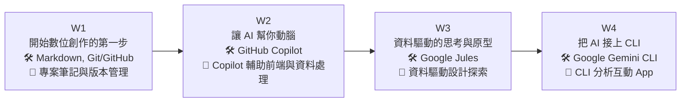

# 🤖 AI創造工作坊: 文科視角的AI應用開發入門

## 課程簡介

## 第 1 週：開始數位創作的第一步

- 工具重點：**Markdown, Git/GitHub**  
- 📚 [課程簡報](https://howard-haowen.github.io/genai_workshop/w1_deck_marp.html)

## 第 2 週：讓 AI 幫你動腦
- 工具重點：**GitHub Copilot**
- 📚 [課程簡報](https://howard-haowen.github.io/genai_workshop/w2_deck_marp.html)
