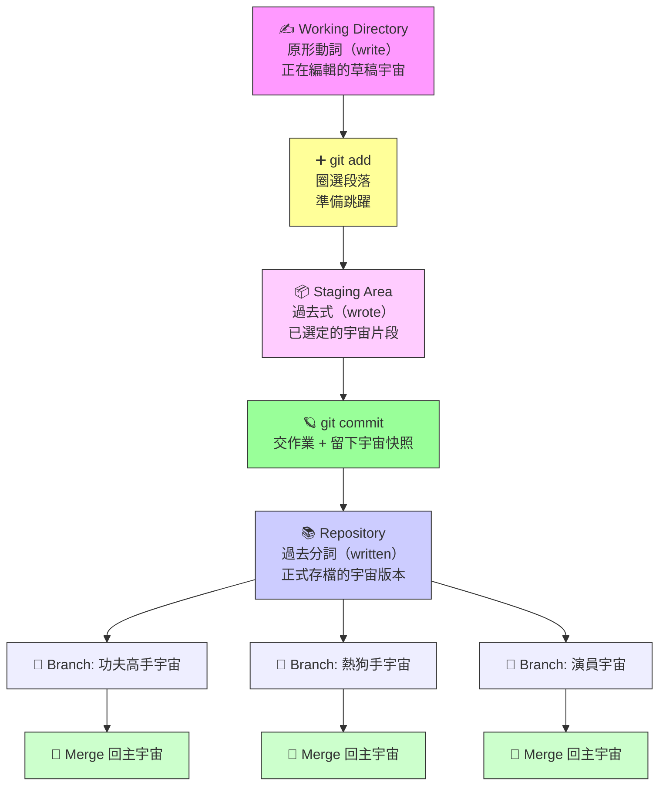

## 🧠 Git 是什麼？它是你專案的「多重宇宙管理員」

Git 是一種版本控制系統，就像你在寫英文作文時會存不同版本，方便回頭修改、比較、甚至合併。但它不只是「存檔」，它是讓你同時活在多個版本宇宙裡的工具——就像《媽的多重宇宙》裡的 Evelyn 一樣，你可以在不同宇宙裡做不同選擇，然後決定哪個版本最值得延續。

---

## 🎓 為什麼不是工程師也該學 Git？

你可能會想：「我不是工程師，學 Git 幹嘛？」但 Git 的價值遠超程式碼，它是跨領域創作者的超能力：

- **寫作與翻譯**：你可以追蹤每一版修改，清楚知道哪裡改了什麼，像是自己的編輯日誌。
- **研究與協作**：多人共同編輯文件時，Git 幫你避免「誰改了什麼」的混亂，還能回溯歷史版本。
- **創意專案管理**：不管是劇本、展覽策劃、教案設計，Git 都能讓你同時探索多種版本，像在平行宇宙裡試驗創意。
- **跨界競爭力**：懂 Git 的人文學生，在跨領域合作中更有話語權，也更容易進入科技、設計、教育等新興領域。

> Git 不是工程師的專利，它是現代創作者的「多重宇宙導航器」。

---

## 📚 Git 的三個狀態 = 英文動詞三態

| Git 狀態         | 英文動詞比喻        | 說明                                                                 |
|------------------|----------------------|----------------------------------------------------------------------|
| **Working Directory** | 原形動詞（write）     | 你正在編輯的內容，還沒存檔或提交。像是在草稿紙上寫東西。                     |
| **Staging Area**     | 過去式（wrote）       | 你選好要提交的部分，像是圈選你要交給老師的段落。準備好但還沒正式送出。         |
| **Repository**       | 過去分詞（written）   | 已正式提交並存檔的版本。像是老師已經收到並存進資料庫的作文。                   |

---

## ➕ add = 圈選段落 + 決定要進入哪個宇宙
在 Git 裡，add 是你從草稿中挑選出想要提交的部分，放進 staging area。就像你在英文作文課上，用螢光筆圈選你覺得寫得不錯的段落，準備交給老師。

你可能在 Working Directory 裡改了很多地方，但不一定每一段都想提交。git add 讓你有選擇權，決定哪些改動值得進入下一個宇宙。

這一步不會真的送出，只是把選中的內容放進「準備交作業」的清單。就像 Evelyn 在《媽的多重宇宙》裡挑選技能準備跳躍，add 是你決定哪些改動要進入下一個宇宙快照的關鍵動作。

---

## ✍️ commit = 交作業 + 留下宇宙快照
每次 commit 就像你在某個宇宙裡做了一個選擇，並留下紀錄。你會附上一句話說明你改了什麼（commit message），像是「加入了 AI 的定義」或「修正了拼字錯誤」。這些 commit 就是你在每個宇宙裡的足跡。

一旦 commit 完成，這個版本就會被存進 Git 的 repository，就像老師正式收下你的作文並存檔。你可以回頭查看每一次提交的內容，甚至跳回過去的版本，就像 Evelyn 能在不同宇宙中自由穿梭。

---

## 🌱 branch = 開啟平行宇宙

**Branch** 是 Git 最迷人的超能力。它讓你在原本的專案宇宙之外，開一個平行宇宙來嘗試不同做法。

就像 Evelyn 在《媽的多重宇宙》裡同時活在「功夫高手宇宙」、「熱狗手宇宙」、「演員宇宙」——你也可以在 Git 裡同時擁有：

- 「加強安全性宇宙」
- 「改 UI 設計宇宙」
- 「試驗新功能宇宙」

每個 branch 都是你專案的另一種可能性，而且彼此不會干擾。

---

## 🔀 merge = 宇宙融合，選擇最好的版本

當你在某個 branch 裡找到更好的做法，就可以 **merge** 回主宇宙（通常叫 `main` 或 `master`）。這就像 Evelyn 決定融合各個宇宙的技能，成為最完整的自己。

但如果兩個宇宙在同一段落有不同寫法，就會出現「衝突」，需要你親自選擇哪個版本要留下——就像 Evelyn 面對人生選擇時的掙扎與決斷。

---

## 🎬 結語：Git 讓你成為你專案的「宇宙跳躍者」

> “使用 Git，就像你是 Evelyn，一邊寫英文作文，一邊在多重宇宙裡探索最棒的版本。你不只是開發者，你是宇宙的編劇、剪接師、導演。”

---

## Git 宇宙跳躍地圖

