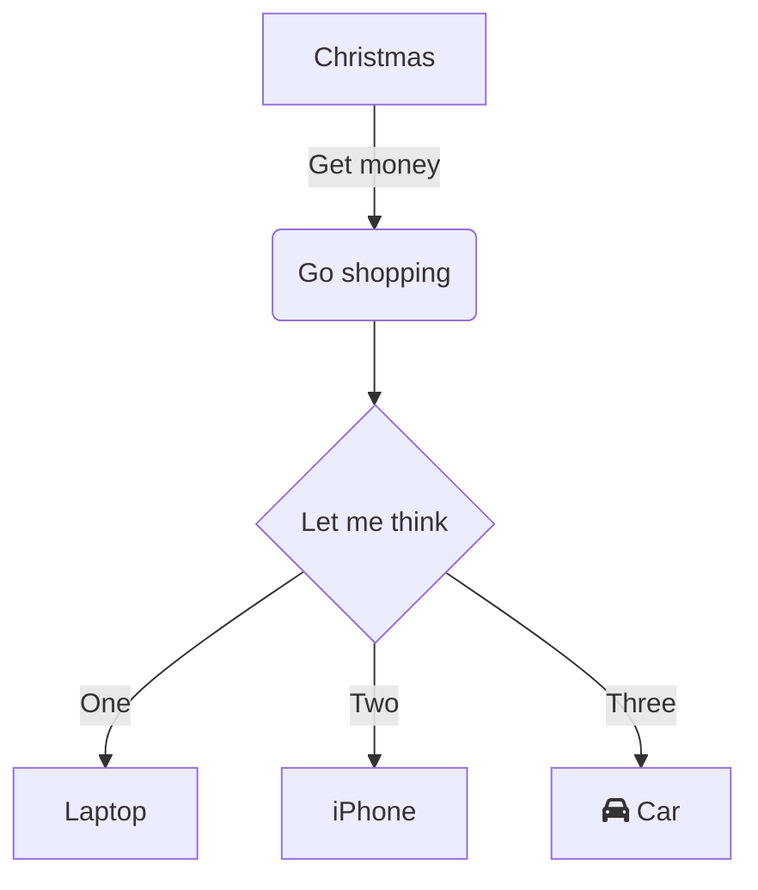

## 🧠 Markdown 基礎

### 一、Markdown 是什麼
- 定義：一種輕量級的標記語言，用來快速撰寫格式化的文字。
- 用途：常見於寫作、筆記、技術文件、GitHub README、部落格等。
- 優點：簡單、直觀、跨平台、容易轉換成 HTML。

---

### 二、常見應用場景
- GitHub 專案文件
- Notion / Obsidian 筆記
- 技術部落格
- 文件撰寫（如 API 文件）
- 簡報
- 網站

---

### 三、基本語法介紹
#### 1. 標題（Headers）
```markdown
# 標題1
## 標題2
### 標題3
```

---


#### 2. 段落與換行
- 直接輸入文字就是段落。
- 段落之間空一行。
- 換行：在行尾加兩個空格再按 Enter。

---

#### 3. 粗體與斜體
```markdown
**粗體**
*斜體*
```

---

#### 4. 清單（Lists）
- 無序清單：
```markdown
- 項目一
- 項目二
```
- 有序清單：
```markdown
1. 第一項
2. 第二項
```

---

#### 5. 超連結與圖片

- 文字超連結

```markdown
更多語法可以參考[這個連結](https://github.com/adam-p/markdown-here/wiki/markdown-cheatsheet)
```

更多語法可以參考[這個連結](https://github.com/adam-p/markdown-here/wiki/markdown-cheatsheet)

---

- 顯示圖片

```markdown

```


---

#### 6. 程式碼區塊
- 單行程式碼：使用反引號 （鍵盤左上角）
`variable_name`

- 多行程式碼：
```python
message = "Hello, Markdown!"
print(message)
```

---


#### 7. 引言（Blockquote）
```markdown
> 這是一段引言
```

#### 8. 分隔線
```markdown
---
```

---

#### 9. Mermaid圖表



---


### 四、工具與平台推薦
- Markdown線上編輯器：[Dillinger](https://dillinger.io/)
- Mermaid線上編輯器：[Mermaid Live Editor](https://mermaid.live/)
- Markdown轉簡報，Marp線上編輯器：[Marp Editor](https://demo.marpeditor.com/)
- 筆記工具：[Obsidian](https://obsidian.md/)、Typora、HackMD
- VS Code 外掛：[Markdown All in One](https://marketplace.visualstudio.com/items?itemName=yzhang.markdown-all-in-one)

---


### 五、實作練習
- 基本練習：請用 Markdown 寫一篇短文，簡單說明你對這堂課的期待，盡量使用上面提到的標記語法。
- 進階練習：模仿上面的 Mermaid 圖表寫一個你認為的軟體開發流程。
